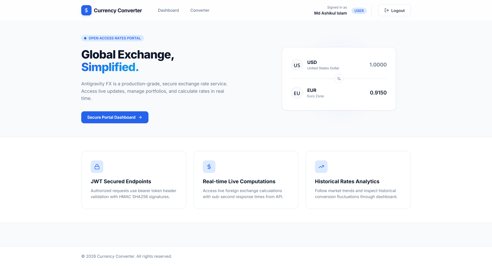
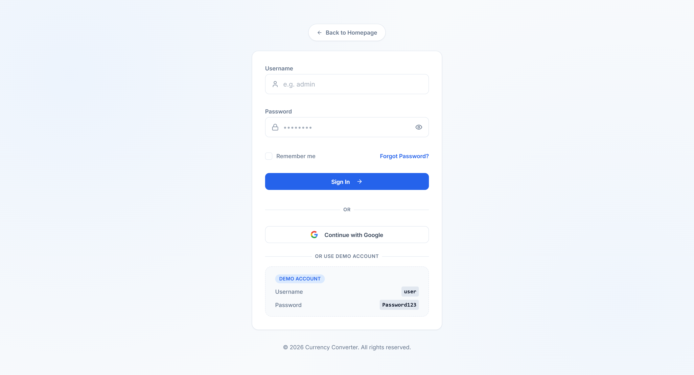
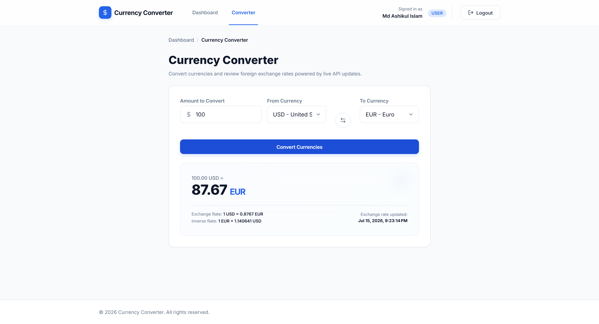
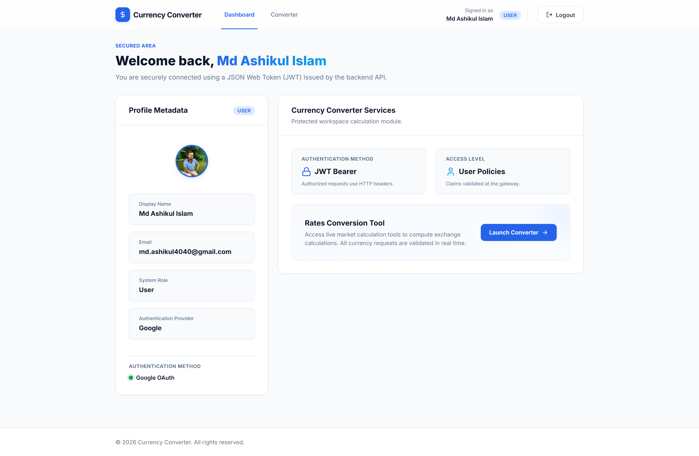

# Modern Currency Converter

A professional, feature-rich web application that performs secure currency calculations and conversions. Built with a robust **.NET 10 Web API** backend adhering to **Clean Architecture** patterns, and a highly responsive, modern **Angular 21** frontend styled with **Tailwind CSS v4**.

The application integrates with the public Frankfurter API to fetch live currency lists and execute conversions under authenticated sessions.

---

## Tech Stack

### Backend
*   **Framework:** `.NET 10` (ASP.NET Core Web API)
*   **Architecture:** Clean Architecture / Domain-Driven Design (DDD) principles
*   **Security:** JSON Web Token (JWT) Bearer Authentication & Google OAuth 2.0 Integration
*   **API Documentation:** OpenAPI (Swagger UI via Swashbuckle)
*   **External Integration:** Typed `HttpClient` connecting to the Frankfurter API
*   **Configuration:** Strongly typed options mapped via the Options Pattern
*   **Containerization:** Docker support targeting .NET 10 runtime

### Frontend
*   **Framework:** `Angular 21` (incorporating Standalone Components, Client Hydration, and Server-Side Rendering)
*   **Layout:** Shell layout with responsive navigation (`ShellComponent`)
*   **State Management:** Reactive state handling leveraging Angular **Signals** (`signal`, `computed`, `asReadonly`)
*   **Styling:** `Tailwind CSS v4` with modern custom glassmorphism and SCSS mixins
*   **Icons:** Lucide Icons (`@lucide/angular`)
*   **Testing:** `Vitest v4` (modern, ultra-fast test runner replacing Karma/Jasmine)

---

## Screenshots

### 🖥️ Homepage / Landing Page


### 🔐 Secure Login Page (Local Credentials & Google OAuth)


### 💱 Currency Converter Dashboard


### 👤 User Profile (Secure Area)


---

## Architectural Highlights

### Backend Design Patterns
1.  **Clean Architecture Isolation:**
    *   **Domain:** Houses pure entity models (`User`, `Currency`) and core business concepts completely free of dependencies on databases, HTTP clients, or framework libraries.
    *   **Application:** Declares business logic interfaces (`IAuthService`, `ICurrencyService`), defines data transfer objects (DTOs), and encapsulates validators and core mapping rules.
    *   **Infrastructure:** Connects application services to concrete external details. Handles HTTP requests to the Frankfurter API, generates cryptographic JWT tokens, reads credentials, and wires up dependencies.
    *   **Web API (Presentation):** Provides REST controllers, implements global exception handling middleware, and exposes configuration and swagger authentication bindings.
2.  **Robust Error Handling:** A centralized middleware intercepts all unhandled errors to format them into standardized JSON envelopes, preventing sensitive stack trace leaks.
3.  **Typed HTTP Clients:** Consumes external services safely using configured, timeout-resilient HTTP clients registered in the Dependency Injection container.

### Frontend Design Patterns
1.  **Shell Layout Shell Pattern:** Uses a central `ShellComponent` layout shell to encapsulate navigation headers, active user profile panels, and responsive footer components.
2.  **Signals State Management:** Manages active user profiles and conversion parameters reactively. Replaces heavy boilerplate architectures (like NgRx) with fine-grained reactivity.
3.  **Functional Interceptors:** An HTTP interceptor automatically appends JWT Bearer tokens to outgoing headers and monitors `401 Unauthorized` responses to seamlessly clear expired sessions and redirect the client to safety.
4.  **Declarative Route Guarding:** Secure routes are protected by a functional route guard (`authGuard`) that inspects authentication state signals in real-time.

---

## Folder Structure

```text
├── backend/
│   ├── CurrencyConverter.Domain/         # Enterprise business rules (Models, Constants)
│   ├── CurrencyConverter.Applicatio/     # Application logic & abstractions (Services, Interfaces, DTOs)
│   ├── CurrencyConverter.Infrastructure/ # Database/external details (JWT, HttpClient, Options)
│   ├── CurrencyConverter.Api/            # ASP.NET Core presentation layer (Controllers, Program.cs, dockerfile)
│   └── CurrencyConverterAssessment.slnx  # Modern XML-based Visual Studio Solution definition
├── frontend/
│   ├── src/
│   │   ├── app/
│   │   │   ├── core/                     # Singleton constructs (guards, interceptors, services, models)
│   │   │   ├── features/                 # Main feature modules (login, currency converter, auth-callback)
│   │   │   └── shared/                   # Common reusable elements and layout controls (shell layout)
│   │   ├── styles/                       # Global styles & layout mixins (Tailwind CSS + SCSS)
│   │   ├── main.ts                       # Angular bootstrap endpoint
│   │   └── server.ts                     # Express server setup for Angular SSR
│   ├── package.json                      # NPM dependencies and development scripts (Vitest)
│   └── angular.json                      # Angular CLI workspace config
├── screenshots/                          # Application screenshots demonstrating the UI
└── README.md                             # Global documentation (This file)
```

---

## API Documentation

All API endpoints return JSON responses wrapped in a standard envelope:
```json
{
  "success": true,
  "message": "Operation completed successfully.",
  "data": { ... }
}
```

### Endpoints Overview

| Method | Endpoint | Auth Required | Description |
| :--- | :--- | :---: | :--- |
| `POST` | `/api/auth/login` | No | Authenticates a user and issues a JWT access token. |
| `GET` | `/api/auth/google-login` | No | Initiates Google OAuth 2.0 authentication challenge. |
| `GET` | `/api/auth/google-callback` | No | Receives Google's response, generates the application JWT, and redirects to Angular. |
| `GET` | `/api/auth/me` | Yes (Bearer) | Decodes the JWT token and returns the current user profile. |
| `POST` | `/api/auth/logout` | Yes (Bearer) | Notifies the server of user sign-out (stateless). |
| `GET` | `/api/currency/currencies` | Yes (Bearer) | Fetches the map of all supported currency codes. |
| `POST` | `/api/currency/convert` | Yes (Bearer) | Converts an amount between source and target currencies. |

### Payload Contract Samples

#### 1. Authentication Login (`POST /api/auth/login`)
*   **Request Payload:**
    ```json
    {
      "username": "admin",
      "password": "Password123"
    }
    ```
*   **Success Response (200 OK):**
    ```json
    {
      "success": true,
      "message": "Login successful.",
      "data": {
        "token": "eyJhbGciOiJIUzI1NiIsInR5cCI...",
        "user": {
          "username": "admin",
          "displayName": "Admin User",
          "role": "Admin"
        }
      }
    }
    ```

#### 2. Get Current Profile (`GET /api/auth/me`)
*   **Success Response (200 OK):**
    ```json
    {
      "success": true,
      "message": "Current user profile retrieved successfully.",
      "data": {
        "username": "admin",
        "displayName": "Admin User",
        "role": "Admin"
      }
    }
    ```

#### 3. Currency Conversion (`POST /api/currency/convert`)
*   **Request Payload:**
    ```json
    {
      "from": "USD",
      "to": "EUR",
      "amount": 100.0
    }
    ```
*   **Success Response (200 OK):**
    ```json
    {
      "success": true,
      "message": "Currency conversion completed successfully.",
      "data": {
        "from": "USD",
        "to": "EUR",
        "originalAmount": 100.00,
        "convertedAmount": 92.45,
        "exchangeRate": 0.9245,
        "timestamp": "2026-07-14T04:20:00Z"
      }
    }
    ```

---

## Configuration & Environment Setup

### Prerequisites
*   [.NET 10 SDK](https://dotnet.microsoft.com/download/dotnet/10.0)
*   [Node.js (v18.x or newer)](https://nodejs.org)
*   [Angular CLI](https://angular.dev/tools/cli) (installed globally via `npm install -g @angular/cli`)

### Running the Backend Web API Locally

1. Navigate into the backend directory:
   ```bash
   cd backend
   ```
2. Restore package dependencies:
   ```bash
   dotnet restore
   ```
3. Run the development server targeting the `CurrencyConverter.Api` project (using the `https` profile for secure Google OAuth callback functionality):
   * **If running from the `backend` folder**:
     ```bash
     dotnet run --project CurrencyConverter.Api --launch-profile https
     ```
   * **If running from inside the `backend/CurrencyConverter.Api` folder**:
     ```bash
     dotnet run --launch-profile https
     ```
   * **If running from the workspace root**:
     ```bash
     dotnet run --project backend/CurrencyConverter.Api --launch-profile https
     ```
4. Verification:
   *   The Web API server starts on **`https://localhost:7118`** (HTTPS).
   *   Access the live interactive Swagger API docs at `https://localhost:7118/swagger`.

#### Mock Accounts (`appsettings.json`)
The application is pre-configured with the following local credentials:
*   **Administrator Account:**
    *   *Username:* `admin`
    *   *Password:* `Password123`
*   **Standard User Account:**
    *   *Username:* `user`
    *   *Password:* `Password123`

#### Google OAuth 2.0 Configuration
Google OAuth credentials are managed securely using **ASP.NET Core User Secrets** to keep keys out of source control.
*   **Setup User Secrets**:
    ```bash
    cd CurrencyConverter.Api
    dotnet user-secrets set "Authentication:Google:ClientId" "your-google-client-id"
    dotnet user-secrets set "Authentication:Google:ClientSecret" "your-google-client-secret"
    ```
*   **Authorized Redirect URI**: Ensure the following redirect URI is configured in your Google Developer Console under the Client ID settings:
    - **Authorized Redirect URIs:** `https://localhost:7118/signin-google`
    - **Authorized JavaScript Origins:** `http://localhost:4200`

---

### Running the Backend Web API with Docker

1. Navigate to the `backend` directory (which acts as the Docker build context to include core referenced projects):
   ```bash
   cd backend
   ```
2. Build the Docker image:
   ```bash
   docker build -t currency-converter-api -f CurrencyConverter.Api/dockerfile .
   ```
3. Run the Docker container:
   ```bash
   docker run -d -p 10000:10000 --name currency-api-container currency-converter-api
   ```
4. Verification:
   * The API will listen on `http://localhost:10000`.
   * *Note: Running Google OAuth in a containerized production setup will require an HTTPS reverse proxy (such as Nginx or Traefik) to manage SSL termination.*

---

### Running the Angular UI

1. Navigate into the frontend root directory:
   ```bash
   cd frontend
   ```
2. Install frontend NPM packages:
   ```bash
   npm install
   ```
3. Start the Angular dev server (configured for SSR and Dev Hydration):
   ```bash
   npm start
   ```
   *   The frontend client will run locally at `http://localhost:4200/`.

---

## Running Tests

### Frontend Testing (Vitest)
Unit tests for Angular components and services are written using `Vitest` for speed and efficiency.
To run the automated test suites:
1. Navigate to the frontend directory:
   ```bash
   cd frontend
   ```
2. Execute the test runner:
   ```bash
   npm run test
   ```
